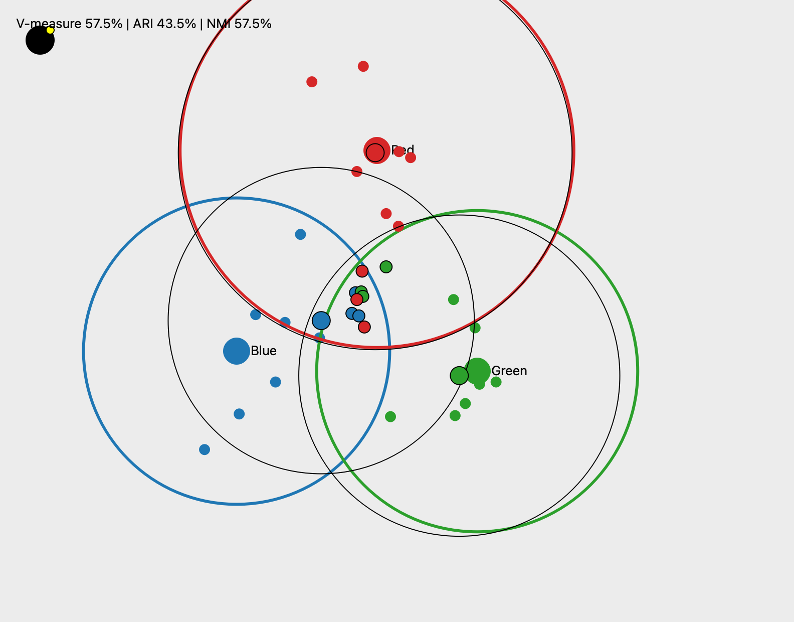
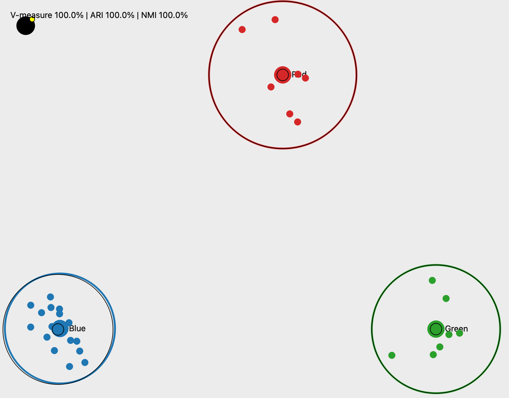
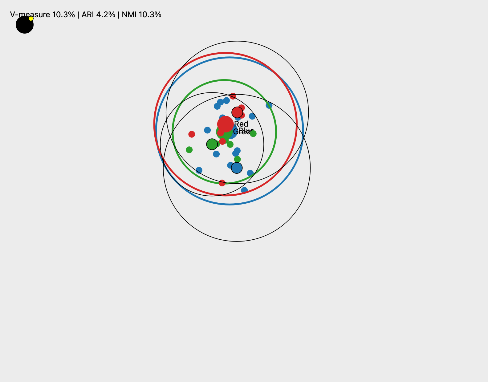
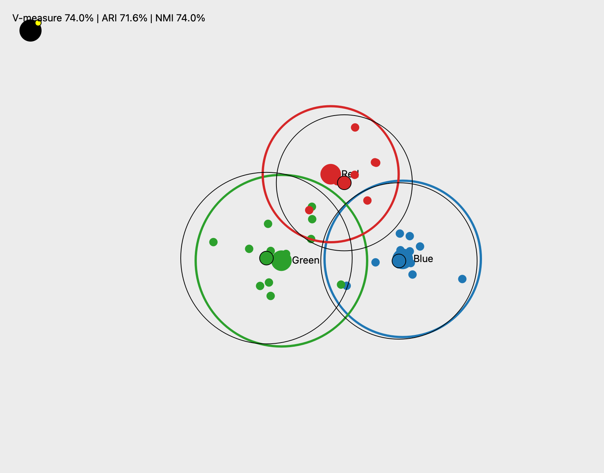

# Points Cluster Playground

Interactive PyQt6 desktop playground for exploring Gaussian clusters, exploding groups, and evaluating k-means recalculations with multiple clustering metrics.

## Quick Start
```bash
pip install -r requirements.txt   # installs PyQt6
python main.py
```
- Toolbar buttons: **Calc K-mean** (compute preview), **Apply K-mean** (commit once per calc), seed spinner (deterministic runs).
- Drag colored centers to move clusters; drag the bomb icon from the top-left onto a center to regenerate that group with amplified/attenuated variance (0.3×–2× bounds).

## Data Flow
```
config/points.json → load_configuration → StateManager
     ↑                                      ↓
 screenshots (output/) ← ScreenshotService ← MainWindow ← Toolbar events
                                     ↑
                             BoardWidget (rendering, dragging, bomb)
```

## Feature Highlights
- **Dynamic envelopes** keep each colored circle large enough to include all 10 members + padding.
- **Bomb drag** resamples mean/variance and repositions every point relative to the new center.
- **K-means previews** render colored ghost centers with black outlines; Apply is enabled only after a calc and disabled immediately after apply.
- **Scoring overlay** on the board shows `V-measure`, `ARI`, `NMI` versus the last applied clustering; toolbar also displays `Score diff` (SSE delta) and raw score.
- **Ground-truth refresh** happens on Apply, so subsequent calcs compare against the most recently accepted configuration.

## Clustering Metrics
- `Score diff`: ((baseline − score)/baseline)*100 — positive means tighter clusters.
- `V-measure`: harmonic mean of homogeneity & completeness vs. last Apply.
- `ARI`: adjusted Rand index vs. last Apply.
- `NMI`: normalized mutual information vs. last Apply.

## Sample Run (local)
1. Launch `python main.py`.
2. Click **Calc K-mean** → overlay prints metrics (e.g., `V-measure 90.2% | ARI 78.1% | NMI 84.5%`); a screenshot is written to `output/`.
3. Click **Apply K-mean** → preview clears, metrics reset, Apply disabled.
4. Drag the bomb onto a center → regenerate points/spread.
5. Click **Calc K-mean** again → expect different metrics (often lower after an explosion).
6. Additional experiments (auto-saved in `output/`):

<p align="center">
  
  
  <br />
  
  
  <br />
  
  
  <br />
  
</p>

## Architecture
- `app/config_loader.py` loads Gaussian parameters.
- `app/logic/*` modules manage sampling, overlap enforcement, variance amplification, clustering, screenshot capture, score tracking, and metric computation (V-measure/ARI/NMI).
- `app/ui/*` hosts `BoardWidget`, `BombOverlay`, `ToolbarWidget`, `MainWindow`.
- `output/` stores every calc screenshot with timestamp.

## Testing
```bash
pytest
```
- `tests/test_clustering.py` validates clustering logic and score computations.
- `tests/test_overlap_manager.py` ensures initial overlap enforcement.

## Notes
- 1/3 overlap is enforced only at initialization; user edits afterward are unconstrained.
- Files adhere to ≤100-line guidance and single-responsibility structure.
